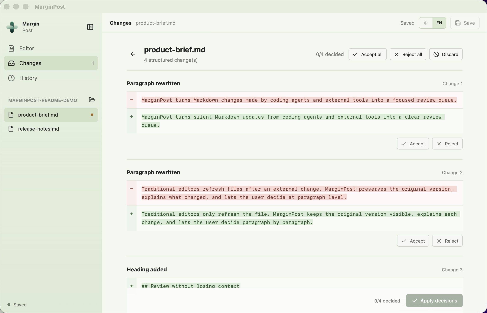
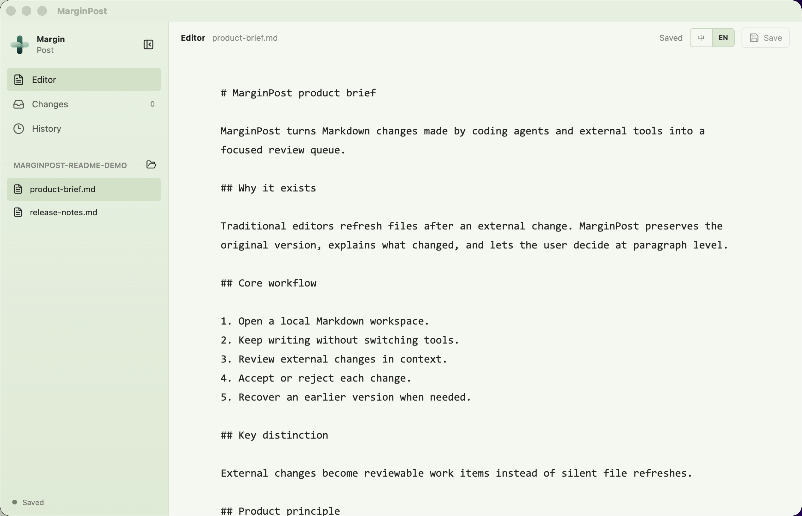
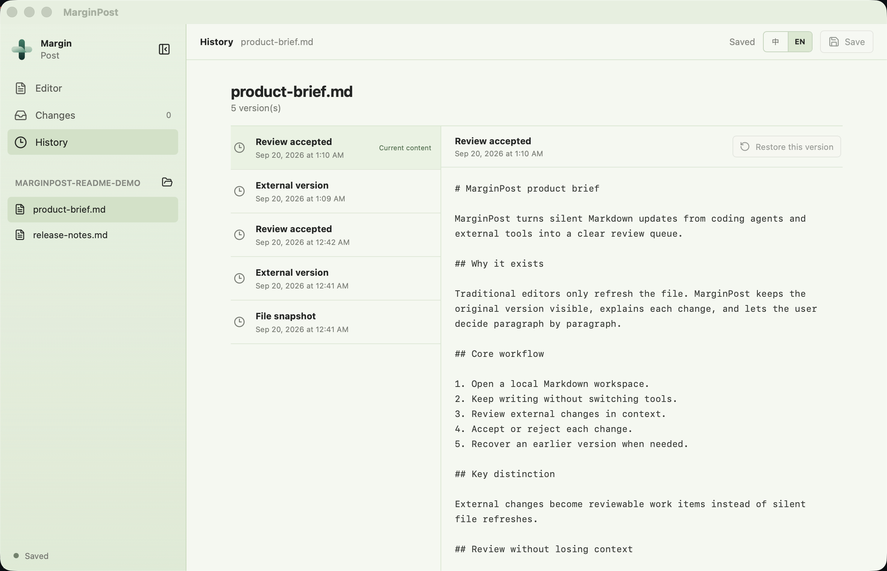

<p align="center">
  <a href="README.zh-CN.md">简体中文</a> · <strong>English</strong>
</p>

<p align="center">
  
</p>

<h1 align="center">MarginPost</h1>

<p align="center">
  Review Markdown changes made by coding agents before they reach disk.
</p>

> V0.1 public preview. The source code is available for testing; packaged
> releases are not yet provided.

MarginPost is a local-first Markdown workspace for reviewing
changes made by coding agents, scripts, and other external tools.

It is designed for people who work with Markdown every day but do not want to
read Git diffs to understand what changed.

## Product Direction

The product combines:

- a calm Markdown editor;
- a persistent inbox for external changes;
- paragraph- and sentence-oriented review;
- accept, reject, and recovery controls;
- local version history.

The core distinction is not simply displaying a diff. Changes are captured as
reviewable work items and presented in document context.

## Product Tour

### Review external changes in context



### Keep editing in the same workspace



### Recover earlier versions



## V0.1 Scope

- Open a local folder
- Drop a local folder or Markdown file into the desktop window
- Basic Markdown editing
- Detect external file changes
- Create change sets
- Sentence- and paragraph-level diff
- Accept or reject individual changes
- Accept or reject an entire change set
- Version history and recovery

## Explicitly Out of Scope

V0.1 does not include AI writing, accounts, cloud sync, team collaboration,
themes, complex export, inferred agent identity detection, multi-agent
conflict resolution, generated change reasons, or risk scoring. Optional
source labels only appear when an external tool explicitly self-reports
through the documented local hook.

## Current Status

The complete V0.1 path has passed local acceptance: workspace editing, external
change capture, persistent pending Change Sets, structured review, individual
and complete decisions, disk conflict protection, SQLite version history,
version preview, and safe restoration. Restoring a version first preserves the
current disk content and records the restore itself. The interface can switch
between Chinese and English and remembers the local preference. On desktop, a
folder can be dropped to open it as the Workspace, while dropping one Markdown
file opens its parent Workspace and selects that file.

Current acceptance is macOS-local. Windows and Linux packaging, signing,
installer behavior, and public distribution remain unverified. The drag-entry
implementation and automated coverage are complete; one physical
Finder-to-window drag check remains for manual confirmation.

## Known Limitations

- Only local macOS development and release-candidate builds are verified.
- Windows and Linux builds, signed/notarized installers, and public update
  delivery are not yet verified.
- Large-file and large-workspace performance has not been benchmarked.
- A formal screen-reader and keyboard-only accessibility audit is pending.
- Agent source labels depend on explicit local hook reporting; MarginPost does
  not infer which process changed a file.

## Technology Direction

- Tauri
- React and TypeScript
- CodeMirror 6
- Rust filesystem services
- SQLite
- Replaceable diff engine

## Quick Start

MarginPost is a desktop app with **no accounts, no API keys, and no
network requirements** — everything runs locally.

Prerequisites:

- macOS (Windows and Linux are unverified; see Current Status)
- [Node.js](https://nodejs.org/) ≥ 22.12
- [Rust](https://rustup.rs/) 1.98.1 (automatically selected by
  `rust-toolchain.toml`)
- Xcode Command Line Tools (`xcode-select --install`)

Build and run the development version:

```bash
git clone https://github.com/wt2xchao-source/marginpost.git
cd marginpost
npm ci
npm run tauri dev
```

Run the test suites:

```bash
npm run typecheck
npm test
npm run build
cargo fmt --check --manifest-path src-tauri/Cargo.toml
cargo test --locked --manifest-path src-tauri/Cargo.toml
cargo check --locked --manifest-path src-tauri/Cargo.toml
```

The frontend build must run before the Rust checks in a clean checkout because
the Tauri configuration references `dist/`.

The repository can be cloned directly from GitHub. Signed installers and
packaged releases are not yet available.

## License

Copyright 2026 MarginPost contributors.

Licensed under the [Apache License, Version 2.0](LICENSE). You may not
use this project except in compliance with the License; see the
`LICENSE` file for the full text. Apache-2.0 was chosen for its express
patent grant, which fits a project that may grow commercial extensions
on top of an open core.

Third-party license texts used by the distributable application are collected
in `THIRD_PARTY_LICENSES.txt`. Regenerate that file after dependency changes
with:

```bash
cargo install cargo-about --version 0.9.1 --locked --features cli
npm run licenses:generate
```

## Trademarks

MarginPost™ and the MarginPost logo are unregistered trademarks of the project
owner. The Apache-2.0 license applies to the source code and does not grant
permission to use the MarginPost name or logo except as required for reasonable
and customary use in describing the project.

## Public Preview

MarginPost is available as a V0.1 public preview under Apache-2.0. No signed
installers or packaged releases are available yet. Use GitHub Issues for bugs
and product feedback, and follow `SECURITY.md` for vulnerability reports.
